# Beese's Poker Lounge

**Arcade video poker and Texas Hold'em for a Raspberry Pi 4 cabinet.**
Jacks or Better, Bonus Poker and Deuces Wild with an exact strategy hint,
plus No-Limit Hold'em sit-and-gos against five AI regulars, all under the
lights of a neon honey lounge. It's written in C with raylib and runs at a
locked 60 fps on the Pi. The shuffles and odds are real, and the credits
are free-play only.

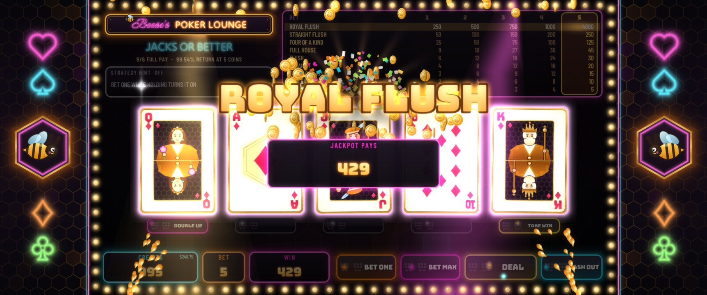

- **Three full-pay video poker games**: 9/6 Jacks or Better (99.54%),
  8/5 Bonus Poker (99.17%) and full-pay Deuces Wild (100.76%), with their
  real paytables and a real 52-card shuffle
- **An exact strategy hint**: it works out the expected return of all 32
  holds of *your* five cards and outlines the best one
- **Double up** on any win: red or black, as many rounds as you dare
- **Texas Hold'em sit-and-go**: six-handed No-Limit against five AI players,
  each with a personality (rock, shark, maniac, fish) and tells you can read.
  Blinds rise every 10 hands, and 1st to 3rd are paid
- **Jackpot presentation**: royal-flush and monster-pot takeovers, coin
  showers, bloom, a live marquee and chasing bulbs
- **Built for the cabinet**: the 1280x720 game is shown 2x on a 3440x1440
  ultrawide, with the Pi's display controller doing the scaling. It runs as
  its own RetroPie Port, keeps power-cut-safe saves, and has an operator's
  service menu

---

## Screenshots

| | |
|---|---|
| 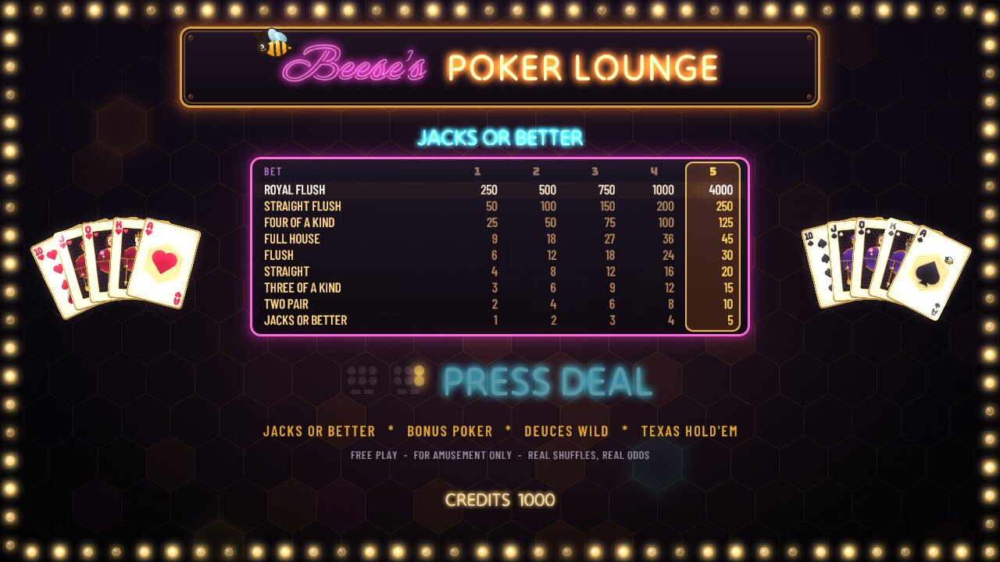 | 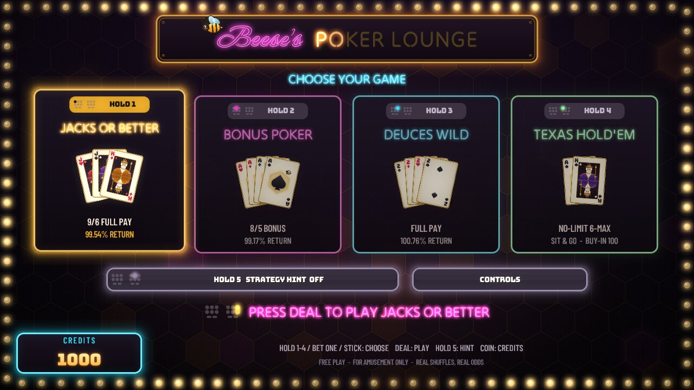 |
| **Attract**: the machine shows itself off between players | **Choose your game**: every key cap shows where its button is on the panel |
| 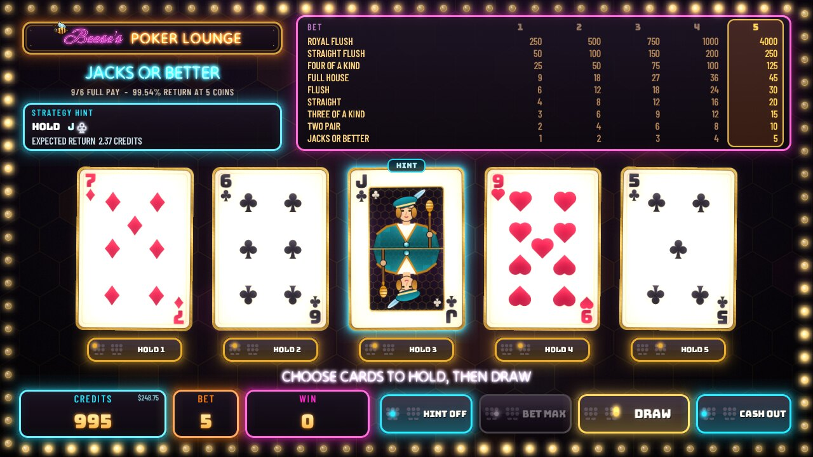 | 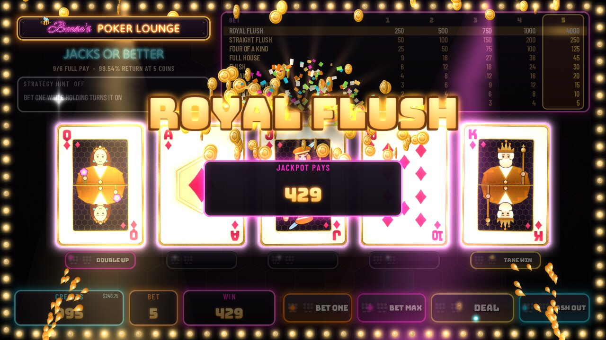 |
| **The strategy hint**: the best hold of your five cards, and what it is worth | **ROYAL FLUSH**: the takeover |
| 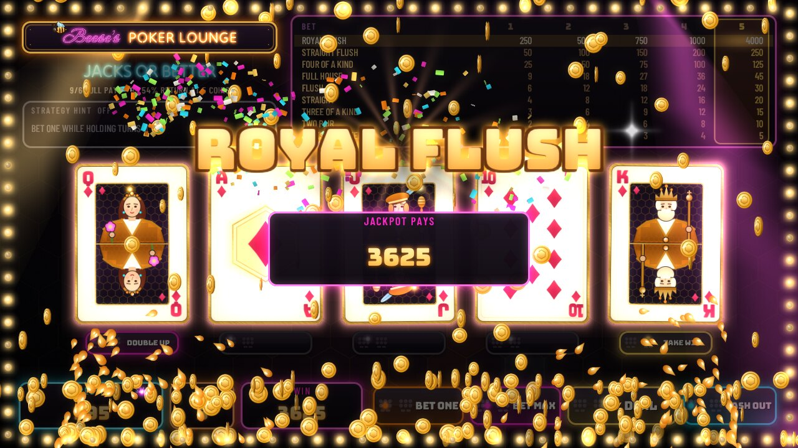 | 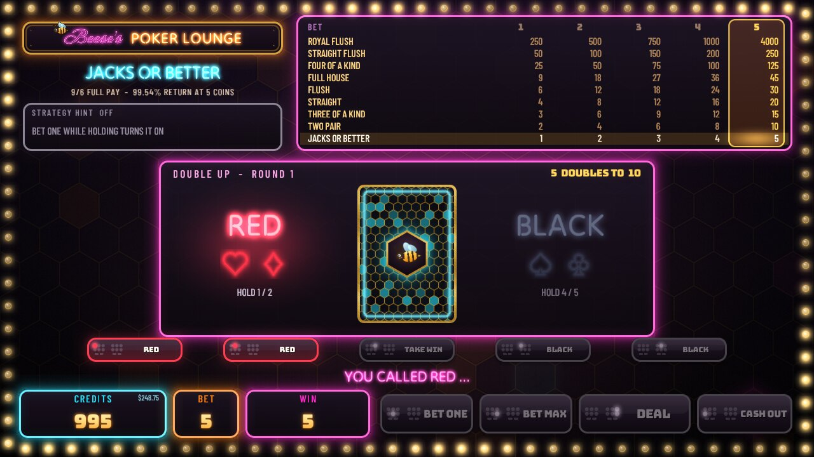 |
| **The count-up** | **Double up**: red or black |
| 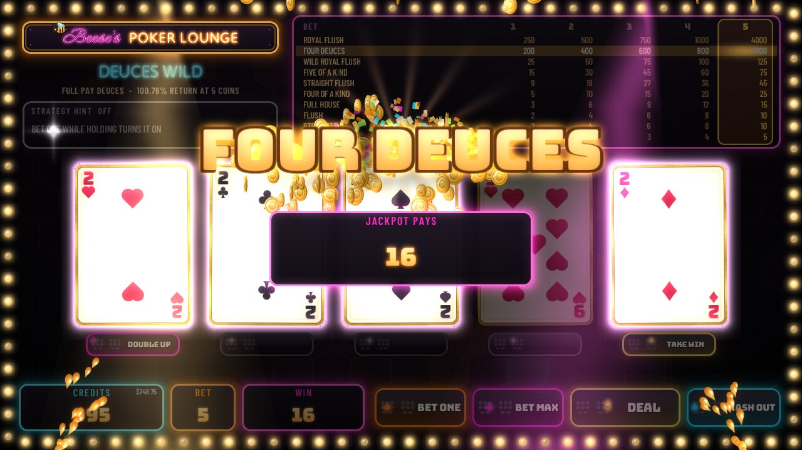 | 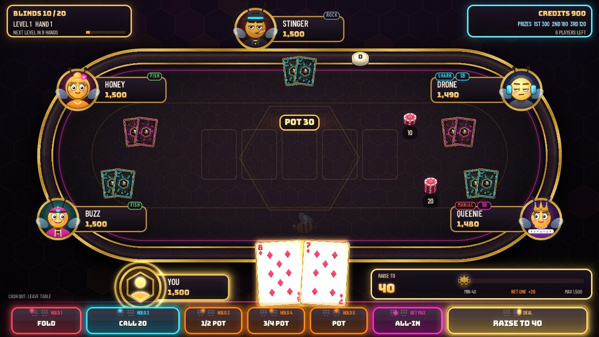 |
| **Deuces Wild**: four deuces, the other jackpot | **Texas Hold'em**: your turn, every action on a panel button |
| 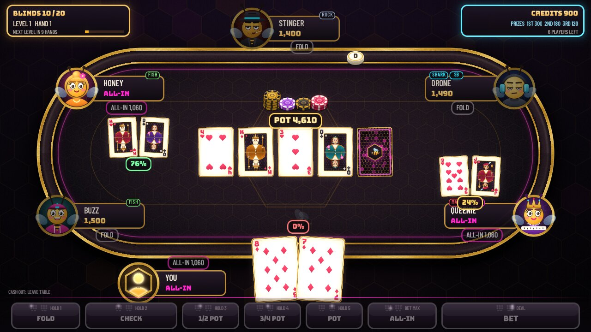 | 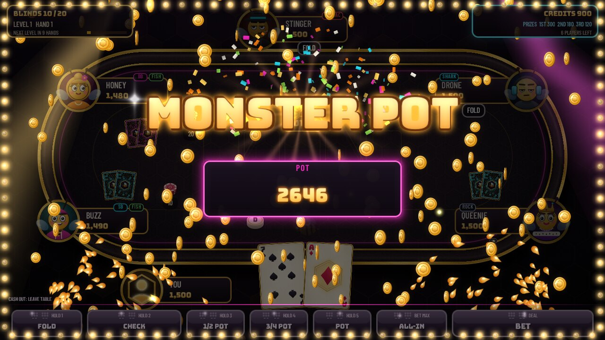 |
| **All-in showdown** with live equities | **MONSTER POT** |
| 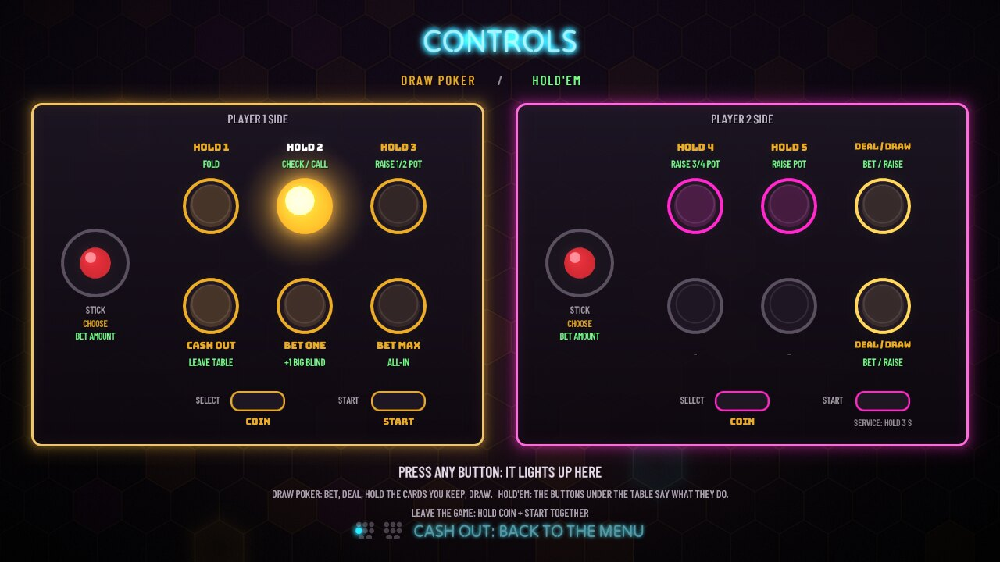 | 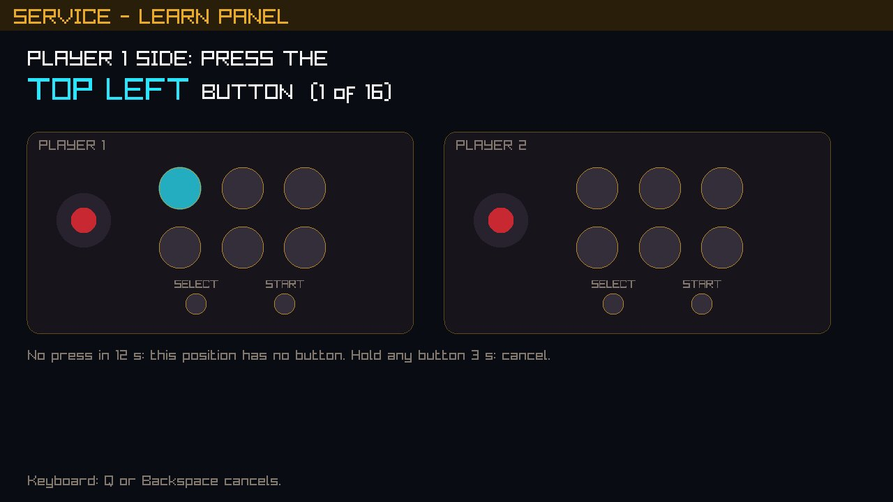 |
| **CONTROLS**: the whole panel, lit as you press | **LEARN PANEL**: the game learns how your panel is wired |

*Screenshots are the game's own frames, rendered headlessly from scripted
button presses with `tools/readme_shots.sh`.*

---

## Controls

The game uses the cabinet's two-player panel: on each side a stick, two rows
of three buttons, and SELECT and START. It lays out its buttons **by
position**, so the top rows of both sides read as one video-poker deck, with
each HOLD under its card and DEAL at the end:

```
            PLAYER 1 SIDE                          PLAYER 2 SIDE
          ( )   [HOLD 1]  [HOLD 2]  [HOLD 3]  |  ( )   [HOLD 4]  [HOLD 5]  [DEAL/DRAW]
         stick  [CASH OUT][BET ONE] [BET MAX] | stick  [  -   ]  [  -   ]  [DEAL/DRAW]
                SELECT = COIN     START       |        SELECT = COIN     START (hold 3 s = SERVICE)
```

| Button | Draw poker | Hold'em |
|---|---|---|
| HOLD 1 - HOLD 5 | hold / release that card | HOLD 1 fold, HOLD 2 check / call, HOLD 3 / 4 / 5 raise ½, ¾ or 1x the pot |
| DEAL / DRAW | deal; draw the cards not held | bet / raise the amount shown |
| BET ONE | bet 1 more (1 to 5); while holding, the strategy hint on / off | +1 big blind to the amount |
| BET MAX | bet 5 and deal | all-in |
| CASH OUT | back to the menu (takes a pending win) | leave the table (press twice) |
| stick | move in menus | the bet amount |
| SELECT | COIN: adds credits | |
| COIN + START | leave the game, back to EmulationStation (held together) | |

In the menu, HOLD 1-4 pick the game, HOLD 5 turns the strategy hint on or
off, and DEAL plays. After a win, HOLD 1 offers a double up; in the double
up, HOLD 1-2 call red, HOLD 4-5 call black and HOLD 3 takes the win.

**You never have to remember this.** Every button on the screen carries a
small drawing of the panel with its position lit, and "PRESS DEAL" shows
where DEAL is. The menu's **CONTROLS** page draws the whole panel with what
each button does, and lights whatever you press. It opens by itself the
first time someone plays.

**Setting up a cabinet: LEARN PANEL.** Which wire of the encoder is in which
position depends on how a panel was built. On its first start the game
offers to learn it. The same wizard is in the service menu (hold player 2's
START for 3 seconds). It asks for each position in turn ("PLAYER 1 SIDE:
PRESS THE TOP LEFT BUTTON") and saves the answer in the save folder. Until
then it assumes RetroPie's usual 6-button layout (Y X L over B A R), which
can also be set by hand in `[panel]` of `config.ini`.

**On a keyboard** (the desktop build): HOLD 1-5 are `1`-`5` (or `Z X C V B`),
DEAL is `Enter`/`Space`, BET ONE `A`, BET MAX `S`, CASH OUT `Q`, COIN
`Insert`, START `Home`, SERVICE `F2`. The arrows are the stick, `F1` shows
the performance overlay, and `Esc` quits.

---

## Install on a RetroPie cabinet

On the Pi, with RetroPie (tested on Debian 13; the installer is written to
handle Raspberry Pi OS Bookworm too):

```sh
git clone https://github.com/cael-beese/Poker.git BeesePokerLounge
cd BeesePokerLounge
./install.sh --dry-run     # shows what it would do
./install.sh
```

It installs any missing build packages, builds raylib 5.5 with our patches
and then the game, and installs it to `/opt/beese-poker`. It adds **Beese's
Poker Lounge** under Ports and touches no other port's files. It adds a line
to `config.txt` only if one is missing (and keeps a backup).
`./install.sh --uninstall` removes it. Restart EmulationStation to see the
new entry. Details: [docs/SYSTEMS.md](docs/SYSTEMS.md).

## Build on a desktop (Linux / WSL)

```sh
tools/fetch_raylib.sh desktop
cmake -S . -B build -DBPL_PLATFORM=DESKTOP
cmake --build build -j
ctest --test-dir build
build/platform/beese-poker
```

## Measured on the cabinet

Pi 4, 3440x1440 display, everything on:

| | measured | budget |
|---|---|---|
| royal-flush takeover, monster-pot takeover, jackpot scene, attract | 60 fps locked, 0 missed frames, 1% low 59.2 | 1% low ≥ 55 |
| memory | 84-85 MB in every mode | ≤ 150 MB |
| textures | 43 MB | ≤ 64 MB |
| draw calls | 5-6 a frame | < 100 |
| cold start to attract | 3.3-3.6 s | ≤ 4 s |
| heaviest AI decision | 3.7 ms | |

How these were measured: [docs/PLATFORM.md](docs/PLATFORM.md) section 9a.

## Documentation

- [docs/SPEC.md](docs/SPEC.md): what is being built
- [docs/CONTRACT.md](docs/CONTRACT.md): how it fits together (engine, games, AI, presentation)
- [docs/SYSTEMS.md](docs/SYSTEMS.md): flow and controls, credits, saves, service menu, attract, install
- [docs/PLATFORM.md](docs/PLATFORM.md): build, display, input, tools, measurements

## License

Source-available, free for noncommercial use under the
[PolyForm Noncommercial License 1.0.0](LICENSE.md). **Any commercial use,
in whole or in part, requires written permission** from the copyright
holder; to ask, open an issue on this repository. raylib and the fonts keep
their own licenses (see LICENSE.md and CREDITS.md).
